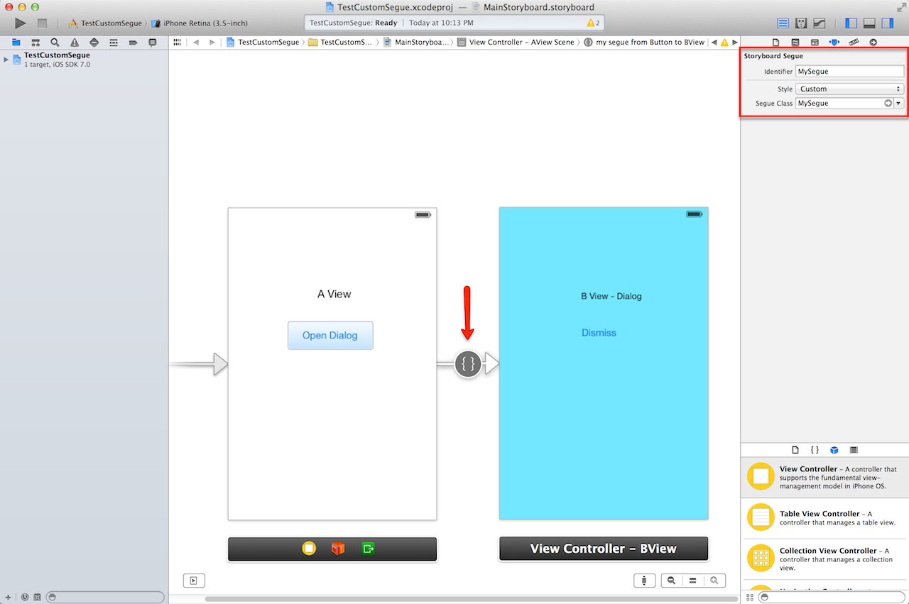

CustomSegue
===========

CustomSegue using Xamarin.iOS (MonoTouch)

Apple Guidance on Custom Segue [here](https://developer.apple.com/library/ios/featuredarticles/ViewControllerPGforiPhoneOS/CreatingCustomSegues/CreatingCustomSegues.html)

Storyboard setup - ID must match the name of the class for your custom segue.
